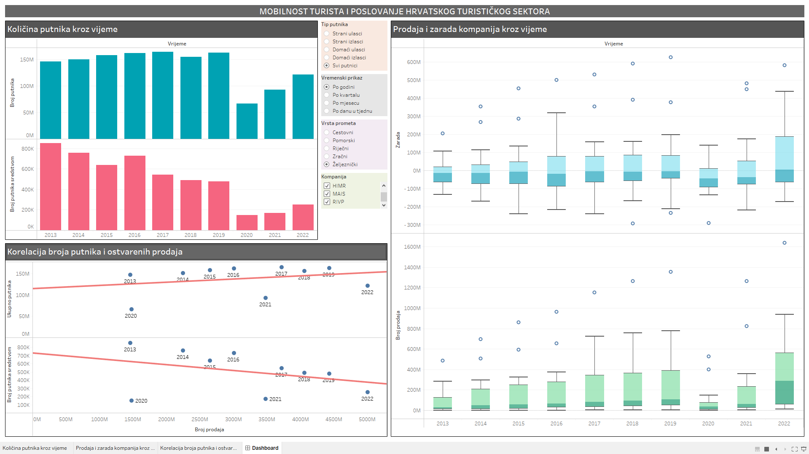

# Tourism Sector Analysis

Analysis of tourist mobility and operations within the Croatian tourism sector, conducted as part of the Statistical Data Analysis course at FER (Faculty of Electrical Engineering and Computing).

## Overview

This repository contains insights and findings from an in-depth analysis of the Croatian tourism sector. It includes a statistical examination of company profits, along with the influx and outflow of tourists at border checkpoints.

## Data Visualizations

[Explore Visualizations](https://public.tableau.com/app/profile/ivan.kapusta/viz/VizPodLab3/Dashboard)

The visualizations provided offer a comprehensive overview of key trends and insights derived from the data. These visualizations were created as part of the Data Visualization course and complement the analysis presented here.

## Contents

- `ProjektSap`: PDF file containing the statistical analysis of tourist mobility and sector operations for the Statistical Data Analysis course.
- `visualization_overview.jpg`: Image showcasing a summary of the visualizations created for the Data Visualization course.
- `presentation.pptx`: Short presentation highlighting interactive visualizations and exploratory data analysis.

## Contributors

Statistical Data analysis
- Ivan Kapusta, Antonio Lukić, David Supančić, Leon Stjepan Uroić

Data Visualization
- Ivan Kapusta, Antonio Lukić
